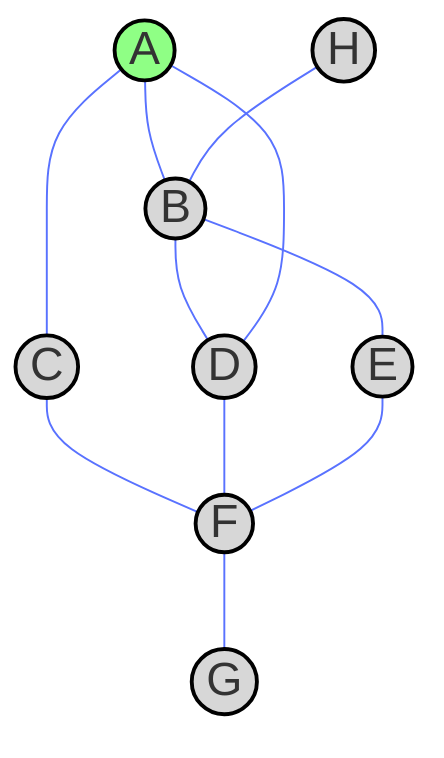

In this post we will show how to transverse a graph using the depth first search algorithm. As usual we will use an example to explain it. Find the code of this post in my github repository [blogging-code](https://github.com/SebastiaAgramunt/blogging-code), in the subdirectory [graphs-depth-first-search](https://github.com/SebastiaAgramunt/blogging-code/tree/main/graphs-depth-first-search).

Consider the following graph


consider we start from node $A$ (marked in green) and we want to visit all the nodes.

## Transversing the graph using depth first search

The way it's done in depth first search is though a **LIFO** (Last In First Out), or equivalently a **stack** data structure. Let's see it through an example. Imagine the following graph and let's say we start from node **A**.

A simple way to represent this graph in python using and adjacency list is

```python
from typing import Dict, List
GraphType = Dict[str, List[str]]

graph = {
    "A": ["B", "C", "D"],
    "B": ["A", "H", "E", "D"],
    "C": ["A", "F"],
    "D": ["B", "A", "F"],
    "E": ["B", "F"],
    "F": ["C", "D", "E", "G"],
    "G": ["F"],
    "H": ["B"],
}
```
The summary of the steps for the depth first search of this graph is

| **Step** | **Current Node** | **Stack (before update)** | **Visited Nodes**          | **Stack (after update)** |
|---------|---------------|----------------------|---------------------------|--------------------------------|
| 0       | A             | []                   | [A]                       | [B, C, D]                     |
| 1       | B             | [C, D]               | [A, B]                    | [A, H, E, D, C, D]            |
| 2       | H             | [E, D, C, D]         | [A, B, H]                 | [B, E, D, C, D]               |
| 3       | E             | [D, C, D]            | [A, B, H, E]              | [B, F, D, C, D]               |
| 4       | F             | [D, C, D]            | [A, B, H, E, F]           | [C, D, E, G, D, C, D]         |
| 5       | C             | [D, E, G, D, C, D]   | [A, B, H, E, F, C]        | [A, F, D, E, G, D, C, D]      |
| 6       | D             | [E, G, D, C, D]      | [A, B, H, E, F, C, D]     | [B, A, F, E, G, D, C, D]      |
| 7       | G             | [D, C, D]            | [A, B, H, E, F, C, D, G]  | [F, D, C, D]                  |


Let's look at some of the first steps:

* Step 0: We visit node $A$ and add to the stack nodes $B$, $C$ and $D$.
* Step 1: Pull the next node in the stack $B$, mark as visited and add the nodes $A$, $H$, $E$ and $D$ from the list of nodes connecting to $B$, now we will have a stack of [$A$, $H$, $E$, $D$, $C$, $D$].
* Step 2: We should pull $A$ from the stack but is already visited so we visit $H$. We expand the stack to [$B$, $E$, $D$, $C$, $D$].
* Step 3: Should visit $B$ but is already visited so we go to the next node in the stack, $E$, mark it as visited and add the nodes to the stack [$B$, $F$, $D$, $C$, $D$]...

The order of the visited nodes is [$A$, $B$, $H$, $E$, $F$, $C$, $D$, $G$]. Notice why we stop at step 7 even though we still have nodes in the stack. In the potential new step we search for the stack and all nodes have been visited so we have finished trasversing the graph.

This algorithm can be coded in python

```python
from typing import Dict, List, Optional

GraphType = Dict[str, List[str]]

def dfs_filo(graph: GraphType, start: str, end: Optional[str] = None) -> bool:
    stack = [start]
    visited = set()

    while stack:
        node = stack.pop()
        if node in visited:
            continue

        visited.add(node)
        print(node, stack)

        if node == end:
            return True
        
        for neighbor in reversed(graph.get(node, [])):  
            if neighbor not in visited:
                stack.append(neighbor)

    return False

if __name__ == "__main__":
    graph = {
        "A": ["B", "C", "D"],
        "B": ["A", "H", "E", "D"],
        "C": ["A", "F"],
        "D": ["B", "A", "F"],
        "E": ["B", "F"],
        "F": ["C", "D", "E", "G"],
        "G": ["F"],
        "H": ["B"],
    }

    print("\nIterative DFS (FILO) starting from A:")
    dfs_filo(graph, "A")

    print("\nIterative DFS (FILO) starting from A and ending at F:")
    dfs_filo(graph, "A", "F")
```

## Checking if a graph is cyclic

With depth fist search we can detect if the graph is cyclic. In the transversal if the node we are going to visit has already been visited, then we have found a loop and instead of continuing we can exit the function and say that the graph is cyclic.

```python
def is_cyclic(graph: GraphType, start: str, end: Optional[str] = None) -> bool:
    stack = [start]
    visited = set()

    while stack:
        node = stack.pop()
        if node in visited:
            return True

        visited.add(node)
        
        for neighbor in reversed(graph.get(node, [])):  
            if neighbor not in visited:
                stack.append(neighbor)

    return False
```

Let's check if the graph is cyclic:

```python
print(f"\nIs the graph cyclic? True/False")
print(is_cyclic(graph, "A"))
```

which clearly is. For instance, we have the loop (A, B, D, A) or (A, C, F, D, B, A).