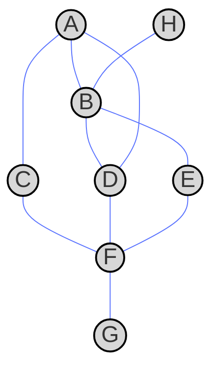
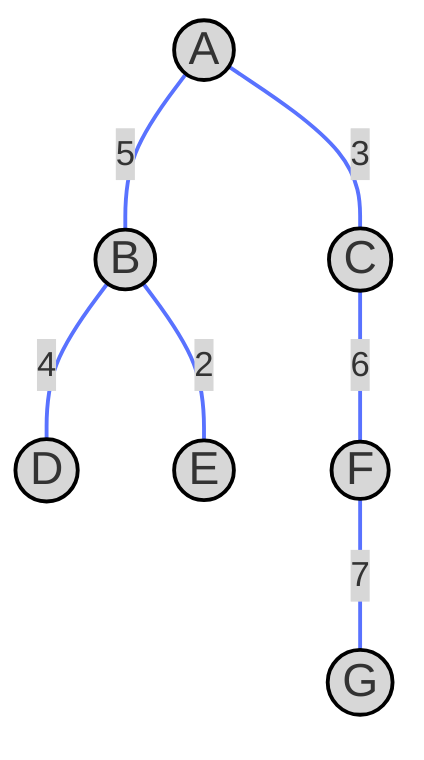
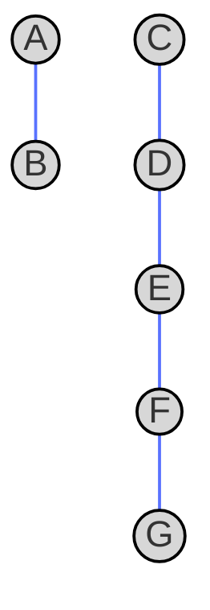
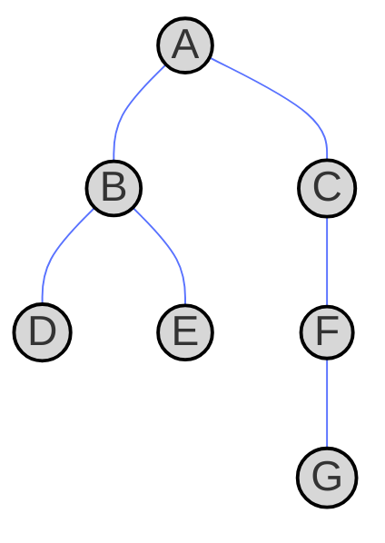
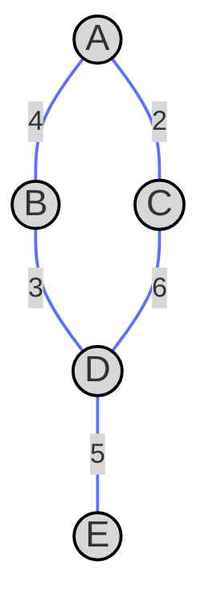
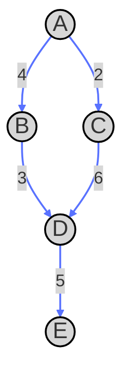

A graph is a structure used in graph theory, consisting of **vertices** (or **nodes**) and **edges** (or **links**) that connect pairs of vertices. Graphs are used to model relationships, networks, and structures in various fields like computer science, social networks, logistics, and physics.

A graph can be represented easily, let's see an example




The circular objects A, B, C, D, E, F, G and H are the **nodes** of the graph and the lines that connect them are the **edges**. In this example the node B is connected to A, H, E and D. What is the maning of these edges and nodes? Why are they connected?. The applications of graphs are many:

* **Computer networks**: Nodes are routers and links are connections. In this application we may be interested to route a signal that goes through the minimum number of nodes so it's faster.
* **Social networks**: Can be modelled with graphs, nodes are people and edges are relationships.
* **Shortest path problems in space**: going from point A to point B in a map with obstacles. For instance nodes can be cities and edges roads. A typical problem is the traveling salesman problem: Given $V$ (nodes) cities, connected with $E$ (edges) roads the salesman has to visit all of them with the minium time possible.
* **Biology**: Neural networks, gene networks and gene interactions.
* **AI and Machine Learning**: Knowledge graphs (links of concepts) and the more modern graph neural networks.

## Types of graphs

In the following subsections we will show the different kinds of graphs


### Directed vs undirected graphs

An undirected graph is a graph whose edges have no directions. The graph above represents an undirected graph, we can go from A to B and from B to A equally. In the following graph we show a directed one


In this directed graph we can go from A to C and from A to B, but not from either C or B to A.

### Weighted vs unweighted graphs

In an unweighted graph all edges are treaded equally, in the first graph shown in this post it is the same to go from A to C than from A to B, let's say is one step. Conversely in weighted graphs the edges are not treated equally and there is a cost associated at each edge, the following is a representation of a weighted graph



In this example the cost to go from A to B and vice versa is 5, from A to C is 3, etc. in a weighted graph we can anticipate of the model of cities and roads. It is not the same to go from A to C than from A to B.

### Connected vs disconnected

A connected graph has a path in between every pair of nodes. If we think of the analogy of cities and roads, that would mean we can reach any city from any other city. All the graphs shown so far are connected graphs. An example of disconnected graph is the following



We can't reach A from C for example. Disconnected graphs are separated graphs.

### Cyclic vs acyclic

A cyclic graph contains at least one path that starts and ends at the same node. An example is the first graph


In this graph we have 5 cyclic paths:

    A → B → D → A
    A → C → F → D → A
    B → D → F → E → B
    A → B → E → F → D → A
    A → B → D → F → A

In the following example we have a special graph, a connected acyclic graph for which any two vertices are connected by at most one path (i.e. there are $V-1$ edges). This is known as a graph **tree**, and is a data structructure used in decision trees in data science (and the basic structure of a random forest). Here is one example:




Take any node of this graph and try to make a closed loop to get back to the same node, you won't be able to close any loop in this example, this means this graph is acyclic. To formally check if a graph is acyclic we will use an algorithm called depth first search.

## Graph representations

There are several ways to represent a graph in computer science and mathematics. The choice of representation depends on the type of graph (directed, undirected, weighted, unweighted) and the operations to be performed (e.g., searching, pathfinding). In this section we present the most common graph representations

- **Adjacency matrix**: Defines a matrix $V\times V$ for which each $i$, $j$ element represents the cost from node $i$ to node $j$.
- **Adjacency list**: Defines a list for the connected nodes, additionally if the graph is weighted it has a numerical value indicating the cost.
- **Edge list**: A list of edges in the graph, usually stored as pairs (V1, V2) with weight (V1, V2, weight) for an edge graph.

In the following we will show a representation of each graph


### Undirected unweighted graph

An example of undirected unweighted graph


#### Adjacency matrix

The corresponding adjacnecy matrix is

|   | A | B | C | D | E | F | G | H |
|---|---|---|---|---|---|---|---|---|
| A | 0 | 1 | 1 | 1 | 0 | 0 | 0 | 0 |
| B | 1 | 0 | 0 | 1 | 1 | 0 | 0 | 1 |
| C | 1 | 0 | 0 | 0 | 0 | 1 | 0 | 0 |
| D | 1 | 1 | 0 | 0 | 0 | 1 | 0 | 0 |
| E | 0 | 1 | 0 | 0 | 0 | 1 | 0 | 0 |
| F | 0 | 0 | 1 | 1 | 1 | 0 | 1 | 0 |
| G | 0 | 0 | 0 | 0 | 0 | 1 | 0 | 0 |
| H | 0 | 1 | 0 | 0 | 0 | 0 | 0 | 0 |

Since there are no weights the connected pairs of nodes are represented with 1 and the disconnected pairs with 0. For undirected graphs the adjacency matrix is symmetric, for every pairs of nodes one can transverse the graph from one to the other (A to B or B to A are equivalent).

#### Adjacency list

And the list representation is

```
A: [B, C, D]
B: [A, D, E, H]
C: [A, F]
D: [B, A, F]
E: [B, F]
F: [C, D, E, G]
G: [F]
H: [B]
```

#### Edge list

```
(A, B)
(A, C)
(B, D)
(B, E)
(C, F)
(D, A)
(D, F)
(E, F)
(F, G)
(H, B)
```

### Undirected weighted graph

Example graph:



#### Adjacency matrix

we have the adjacency matrix

|   | A | B | C | D | E |
|---|---|---|---|---|---|
| A | 0 | 4 | 2 | 0 | 0 |
| B | 4 | 0 | 0 | 3 | 0 |
| C | 2 | 0 | 0 | 6 | 0 |
| D | 0 | 3 | 6 | 0 | 5 |
| E | 0 | 0 | 0 | 5 | 0 |

which is still symmetric becuase the graph is undirected. But see that the that now the values represent exactly the cost to go from each node to each node. Another observation is that for undirected graphs we need to store only $V^2/2$ values of the matrix.


#### Adjacency list

The adjacency list for this undirected weithed graph is

```
A: [(B, 4), (C, 2)]
B: [(A, 4), (D, 3)]
C: [(A, 2), (D, 6)]
D: [(B, 3), (C, 6), (E, 5)]
E: [(D, 5)]
```

#### Edge list

The edge list for the graph

```
(A, B, 4)
(A, C, 2)
(B, D, 3)
(C, D, 6)
(D, E, 5)
```

### Directed weighed graph

Consider this directed weighted graph:


#### Adjacency matrix

Has the following adjacency matrix

|   | A | B | C | D | E |
|---|---|---|---|---|---|
| A | 0 | 4 | 2 | 0 | 0 |
| B | 0 | 0 | 0 | 3 | 0 |
| C | 0 | 0 | 0 | 6 | 0 |
| D | 0 | 0 | 0 | 0 | 5 |
| E | 0 | 0 | 0 | 0 | 0 |

See that is non symmetric. In general for any directed graph we need to store the $V^2$ values that connect each pair of nodes.

#### Adjacency list

This representation defines a list

```
A: [(B, 4), (C, 2)]
B: [(D, 3)]
C: [(D, 6)]
D: [(E, 5)]
E: []
```

#### Edge list

And finally the edge list

```
(A, B, 4)
(A, C, 2)
(B, D, 3)
(C, D, 6)
(D, E, 5)
```

### Tree

As mentioned before, a tree is a connected acyclic with $V-1$ edges. An example graph shown before


#### Adjacency matrix


|   | A | B | C | D | E | F | G |
|---|---|---|---|---|---|---|---|
| A | 0 | 1 | 1 | 0 | 0 | 0 | 0 |
| B | 1 | 0 | 0 | 1 | 1 | 0 | 0 |
| C | 1 | 0 | 0 | 0 | 0 | 1 | 0 |
| D | 0 | 1 | 0 | 0 | 0 | 0 | 0 |
| E | 0 | 1 | 0 | 0 | 0 | 0 | 0 |
| F | 0 | 0 | 1 | 0 | 0 | 0 | 1 |
| G | 0 | 0 | 0 | 0 | 0 | 1 | 0 |


#### Adjacency list

```
A: [B, C]
B: [A, D, E]
C: [A, F]
D: [B]
E: [B]
F: [C, G]
G: [F]
```

#### Edge list

```
(A, B)
(A, C)
(B, D)
(B, E)
(C, F)
(F, G)
```

### Complexities of different graph representations

In the following table we compare the different graph representations shown in this post

| Representation     | Space Complexity | Edge Existence Check | Neighbor Traversal  | Best for                                  |
|-------------------|-----------------|----------------------|---------------------|------------------------------------------|
| **Adjacency Matrix** | $O(V^2)$     | $O(1)$            | $O(V)$           | Dense graphs, fast edge lookup          |
| **Adjacency List**  | $O(V + E)$   | $O(\text{degree}(v))$ | $O(\text{degree}(v))$ | Sparse graphs, efficient traversal  |
| **Edge List**       | $O(E)$       | $O(E)$            | $O(E)$           | Small graphs, simple storage            |

Let's define each column:

* **Space Complexity** : The number elements needed to describe a graph. This is important for memory issues.
* **Edege Existence Check** : The time complexity for an algorithm to check if two nodes in the graph are connected by an edge.
* **Neighbor Traversal** :The time complexity for an algorithm that finds all the nodes connected to a given node.

Let's analyze one by one each representation and reason why we have these complexities. For the adjancency matrix the space complexity is the number of vertices to the square, of course, it's a matrix of $V \times V$. The edge existence check is of order $1$ because we just need to check an element in the adjacency matrix, e.g. if $a_{i,j} \neq 0$ (where $a_{i,j}$ is the matrix element for nodes $i$ and $j$). This is immediate if we use the proper data structures, normally pointers in the heap of the memory. For the neighbor traversal the complexity is $V$ as for a given node we need to check all other nodes $V-1$ for the column and $V-1$ for the row, tha tis complexity $V$, i.e. linear with the number of nodes.

In the adjacency list the space complexity is $V+E$. First, it's linear with the number of nodes because each of the vertices is stored as a key in the list, then is linear to the edges because each edge is store as an entry in the list. The edge existence is $O(\text{degree}(v))$, this is, of the order of number of neighbors of the node $v$, as opposed to the adjacency matrix we need to scan the list. The same happens with neighbor traversal for the adjacency list.

The edge list has space complexity linear with the number of edges, this is because we store a list of all the edges. The edge existence is also linear with the number of edges as to find an edge we need to scan the list of our edges, and that is obviously linear with the number of edges (they are unsorted). Finally the neighbor trasversal is the same as we need to scan linearly all the list to find all the neighboring nodes of a give one.

Which method is best?. It depends of the kind of graph (see last column). For dense matrices (many edges) you may use adjacency matrices as the lookup for tables is very fast, however if there are many nodes the space complexity increases very fast. The adjacency list is good if you have a sparse graphs (few edges), it is efficient for saving space and the trasnversal is faster as it depends on the number of neighbors (low in sparse graphs). We will mostly use these two representations but the edge list is more predictable (everything is linear with the number of edges) and is best for small graphs. 


## Wrap up

This post is just the basics of graphs, what they are used for, their properites and classification. I wanted to make sure we had different visual representations of each kind of graph so that the reader could learn better the topic, as we say, an image is worth more than a thousand words.

In the next posts we will learn how to transverse (explore) graphs and different algorithms to do it. This is an exciting and practical topic!.