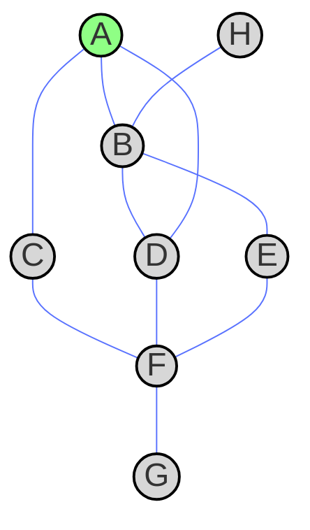

In this post we will review what is breadth first transversal and compare it to depth first transversal. As usual the code can be found in my github repository [blogging-code](https://github.com/SebastiaAgramunt/blogging-code) and for this post in the subdirectory [graphs-breadth-first-search](https://github.com/SebastiaAgramunt/blogging-code/tree/main/graphs-breadth-first-search).

Consider the following graph


consider we start from node $A$ (marked in green) and we want to visit all the nodes.

## Transversing the graph using breadth first search

As opposed to depth first search where we explore the node that is last included in the list (we do this with a stack / first in last out FILO queue), in breadth first search (BFS) the nodes are explored diffrently, the first that comes in to the list is the first to be explored. We do this with a first in first out FIFO or a queue data structure. 

The graph can be represented in python with

```python
from typing import Dict, List, Optional
GraphType = Dict[str, List[str]]

graph = {
    "A": ["B", "C", "D"],
    "B": ["A", "H", "E", "D"],
    "C": ["A", "F"],
    "D": ["B", "A", "F"],
    "E": ["B", "F"],
    "F": ["C", "D", "E", "G"],
    "G": ["F"],
    "H": ["B"],
}
```

The BFS transversal of this graph is

| **Step** | **Current Node** | **Queue (before update)** | **Visited Nodes**       | **Queue (after update)** |
|---------|---------------|------------------------|--------------------------|-----------------------------------|
| 0       | A             | []                     | [A]                      | [B, C, D]                         |
| 1       | B             | [C, D]                 | [A, B]                   | [C, D, A, H, E, D]                |
| 2       | C             | [D, A, H, E, D]        | [A, B, C]                | [D, A, H, E, D, A, F]             |
| 3       | D             | [A, H, E, D, A, F]     | [A, B, C, D]             | [A, H, E, D, A, F, B, A, F]       |
| 4       | H             | [E, D, A, F, B, A, F]  | [A, B, C, D, H]          | [E, D, A, F, B, A, F, B]          |
| 5       | E             | [D, A, F, B, A, F, B]  | [A, B, C, D, H, E]       | [D, A, F, B, A, F, B, B, F]       |
| 6       | F             | [B, A, F, B, B, F]     | [A, B, C, D, H, E, F]    | [B, A, F, B, B, F, C, D, E, G]    |
| 7       | G             | []                     | [A, B, C, D, H, E, F, G] | [F]                               |

Let's analyze the steps:

- Step 0: We start from $A$, we populate the list with $B$, $C$, $D$, being $B$ the first node added,
- Step 1: pop the first element that was added to the queue, this is $B$, we mark it as visited and we add its nodes $A$, $H$, $E$ and $D$.
- Step 2: pop the next element in the queue, that is $C$, add its nodes, $D$, $A$, $F$.
- Step 3: pop the next element in the queue, $D$, again add it to visited and add the linked nodes $B$, $A$ and $F$.
- Step 4: The next element to explore would be $A$ but that is already visted so we explore the following in the queue, that is $H$. We add the node $B$ to the queue.

The algorithm can be coded as

```python
from typing import Dict, List, Optional
from collections import deque

GraphType = Dict[str, List[str]]

def bfs_fifo(graph: GraphType, start: str, end: Optional[str] = None) -> bool:
    queue = deque([start])
    visited = set()

    while queue:
        node = queue.popleft()
        if node in visited:
            continue

        visited.add(node)
        print(node, queue)

        if node == end:
            return True
        
        for neighbor in graph.get(node, []):  
            if neighbor not in visited:
                queue.append(neighbor)

    return False

if __name__ == "__main__":
    graph = {
        "A": ["B", "C", "D"],
        "B": ["A", "H", "E", "D"],
        "C": ["A", "F"],
        "D": ["B", "A", "F"],
        "E": ["B", "F"],
        "F": ["C", "D", "E", "G"],
        "G": ["F"],
        "H": ["B"],
    }

    print("\nIterative BFS (FIFO) starting from A:")
    bfs_fifo(graph, "A")
```

The `deque` structure is a convenient data structure in python see [this post](https://www.geeksforgeeks.org/deque-in-python/). It has the method `pop_left` that allows you to pop the lefmost element of the list in O(1). We could code this in lists as well but in this case `pop` is `O(N)`. In another post we will show how to implement `stacks` and `queues` in C++ it's a beautiful exercise.

## DFS vs BFS

In BFS the exploration is first on the closest nodes and last the furthest nodes from the initial. That can help us find the shortest path in between two nodes. Starting from a node $X$ and transversing in BFS wenever we first find then node $Y$ we know that the **path is the shortest**. BFS is suitable in cases like social networks, web creawling or network packing routing as what's interesting in those cases is to explore the nodes that are close to the initial node. For instance, in social networks we are interested in knowning the relationship between closer nodes hence we would use BFS.

DFS is suitable to explore first the nodes that are not close to the initial node. For instance, in solving a maze: One is not interested in exploring all the possible paths in the neighbourhood of the beginning but rather move far from the original node and backtrack if it finds a dead end. Also DFS can find any path in between two nodes if it exist, however does not guarantee the shortest.

A table to compare the differences between DFS and BFS.

| **Feature**              | **BFS (Breadth-First Search)**          | **DFS (Depth-First Search)**         |
|-------------------------|---------------------------------|---------------------------------|
| **Exploration Order**   | Explores **level by level** (all neighbors first) | Explores **deep paths first**, then backtracks |
| **Data Structure Used** | **Queue (FIFO)** | **Stack (LIFO)** (or recursion) |
| **Best for**            | **Finding the shortest path** in an unweighted graph | **Deep exploration** (finding connected components, topological sorting) |
| **Shortest Path Guarantee** | ✅ **Yes** (first time a node is reached, it’s via the shortest path) | ❌ **No** (may take a longer path before finding the shortest one) |
| **Memory Usage**        | **O(V)** (stores all nodes at a level before proceeding) | **O(V) in worst case**, but can be **O(depth)** with recursion |
| **Use Case Examples**   | - Shortest path (e.g., mazes, road networks)  <br> - Social networks <br> - Web crawlers <br> - Network packet routing | - Pathfinding in **mazes** <br> - **Topological sorting** <br> - **Cycle detection** <br> - **Backtracking problems** (e.g., Sudoku, N-Queens) |
| **Handling Large Graphs** | **Requires more memory** (holds many nodes in the queue) | **Uses less memory** (only needs to track one deep path) |
| **Handles Infinite Graphs?** | ✅ **Yes**, because it explores in levels | ❌ **No**, because it may get stuck in an infinite loop |
| **Can detect cycles?** | ✅ Yes | ✅ Yes |

